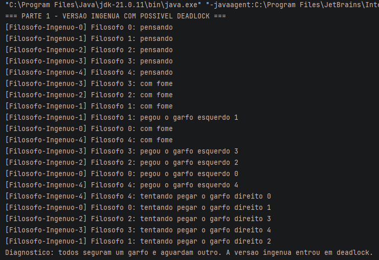
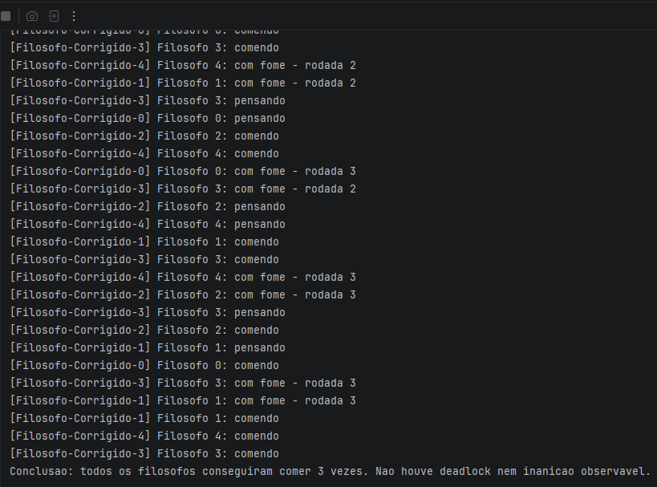
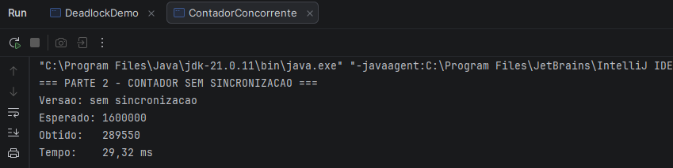
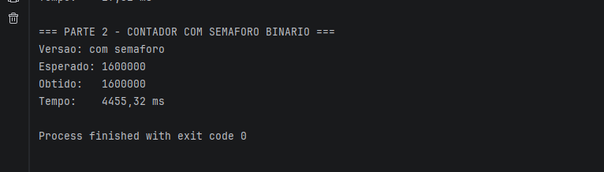
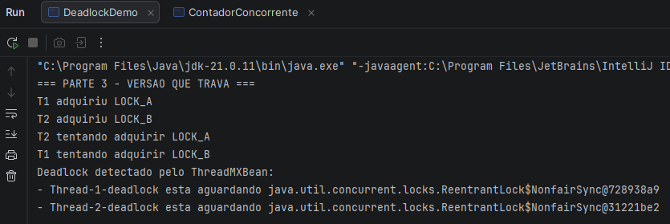
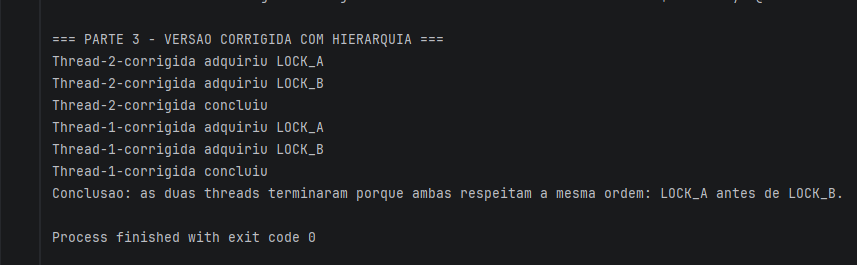

# TDE — Detecção e recuperação de impasses

## Integrantes

- Álvaro Pataki
- Bruno Frosi
- Dalter Barbosa
- Pedro Honorio

**Linguagem escolhida:** Java  
**Versão recomendada:** JDK 17 ou superior  
**Link do vídeo no YouTube:** inserir link público ou não listado

## Como executar
### IntelliJ IDEA

1. Abrir o projeto no IntelliJ IDEA.
2. Executar:
    - JantarFilosofos.java
    - ContadorConcorrente.java
    - DeadlockDemo.java
3. Observar os logs gerados no console.

### Via terminal
```bash
javac parte1-filosofos/JantarFilosofos.java
java -cp parte1-filosofos JantarFilosofos

javac parte2-semaforo/ContadorConcorrente.java
java -cp parte2-semaforo ContadorConcorrente

javac parte3-deadlock/DeadlockDemo.java
java -cp parte3-deadlock DeadlockDemo
```

---
# Parte 1 — Jantar dos Filósofos

## Cenário reproduzido
Foram simulados 5 filósofos e 5 garfos. Cada filósofo alterna entre os estados pensando, com fome e comendo. Para comer, o filósofo precisa adquirir dois garfos: o garfo à esquerda e o garfo à direita.

## Versão ingênua
Na versão ingênua, todos os filósofos pegam primeiro o garfo da esquerda e depois tentam pegar o garfo da direita. Quando todos conseguem pegar o garfo da esquerda ao mesmo tempo, cada um fica esperando o garfo da direita, que já está ocupado pelo vizinho. Assim, ocorre deadlock.

## Versão corrigida com garçom
Na versão corrigida, foi usado um semáforo como garçom com N-1 permissões. Como existem 5 filósofos, apenas 4 podem tentar comer ao mesmo tempo.
Essa estratégia impede que todos os filósofos segurem um garfo simultaneamente. Com isso, pelo menos um filósofo sempre consegue pegar os dois garfos, comer e liberar os recursos.

## Condição de Coffman negada
A solução nega a condição de espera circular, pois impede que os 5 filósofos fiquem simultaneamente segurando um garfo e esperando outro.

## Justiça e progresso
A execução mostra que todos os filósofos conseguiram comer 3 vezes. Portanto, houve progresso e não foi observada inanição.
## Pseudocódigo da versão corrigida

```text
garcom = Semaforo(4)

para cada filosofo:
    enquanto verdadeiro:
        pensar()

        garcom.acquire()

        pegar garfo esquerdo
        pegar garfo direito

        comer()

        devolver garfo direito
        devolver garfo esquerdo

        garcom.release()
```
---

# Parte 2 — Threads e semáforos

## Versão sem sincronização
Na versão sem sincronização, várias threads leem e escrevem o contador ao mesmo tempo. A operação `contador++` parece simples, mas internamente envolve três etapas:

1. ler o valor atual;
2. somar 1;
3. gravar o novo valor.

Se duas threads leem o mesmo valor antes de alguma gravar, uma atualização pode sobrescrever a outra. Por isso, o valor final pode ficar menor que o esperado.

## Versão com semáforo binário

Na versão corrigida, foi usado um `Semaphore(1, true)`. Como ele tem apenas uma permissão, somente uma thread entra na seção crítica por vez. Assim, o incremento do contador passa a ser executado com exclusão mútua.

## Tabela de resultados


| Execução | Versão | Valor esperado | Valor obtido |      Tempo |
|---|---|---:|-------------:|-----------:|
| 1 | Sem sincronização | 1.600.000 |      308.254 |   27,82 ms |
| 2 | Sem sincronização | 1.600.000 |      330.544 |   28,82 ms |
| 3 | Sem sincronização | 1.600.000 |      289.550 |   29,32 ms |
| 1 | Com semáforo | 1.600.000 |    1.600.000 | 4499,69 ms |
| 2 | Com semáforo | 1.600.000 |    1.600.000 | 4987,27 ms |
| 3 | Com semáforo | 1.600.000 |    1.600.000 | 4455,32 ms |

## Discussão

A versão sem sincronização perde incrementos porque o acesso ao contador não é protegido. Duas ou mais threads podem disputar a mesma variável e sobrescrever atualizações umas das outras. Isso caracteriza uma condição de corrida.

A versão com semáforo é correta porque transforma o trecho de incremento em uma seção crítica. O método `acquire()` bloqueia a thread quando outra já está usando o recurso, e o método `release()` libera a próxima execução. Em Java, também existe uma relação de ordenação e visibilidade entre `release()` e `acquire()`, conhecida como *happens-before*, garantindo que as alterações feitas por uma thread fiquem visíveis para a próxima.

O custo da solução é desempenho. A versão com semáforo tende a ser mais lenta, porque as threads precisam esperar sua vez. Portanto, há um trade-off entre correção e throughput.

## Pseudocódigo

```text
contador = 0
semaforo = Semaphore(1)

Thread:
    repetir M vezes:

        // versão sem sincronização
        contador++

        // versão com semáforo
        semaforo.acquire()
        contador++
        semaforo.release()
```
---

# Parte 3 — Deadlock

## Cenário reproduzido

Foram usadas duas threads e dois locks: `LOCK_A` e `LOCK_B`.

Na versão que trava:

- a Thread 1 pega `LOCK_A` e depois tenta pegar `LOCK_B`;
- a Thread 2 pega `LOCK_B` e depois tenta pegar `LOCK_A`.

Com um pequeno `sleep`, a chance de deadlock fica maior, porque cada thread segura um lock antes de tentar pegar o outro.

## Condições de Coffman no cenário

1. **Exclusão mútua:** cada lock só pode estar com uma thread por vez.
2. **Manter e esperar:** a Thread 1 segura `LOCK_A` esperando `LOCK_B`, enquanto a Thread 2 segura `LOCK_B` esperando `LOCK_A`.
3. **Não preempção:** uma thread não pode tomar o lock da outra à força.
4. **Espera circular:** T1 espera T2 liberar `LOCK_B`, e T2 espera T1 liberar `LOCK_A`.

## Correção implementada

A correção usa uma hierarquia de recursos. A regra global é: **todas as threads devem adquirir primeiro `LOCK_A` e depois `LOCK_B`**.

Com essa regra, não existe mais a possibilidade de uma thread pegar `LOCK_B` antes de `LOCK_A`, enquanto outra faz o contrário. Isso elimina a espera circular.

## Pseudocódigo da versão corrigida

```text
Regra global:
    sempre adquirir LOCK_A antes de LOCK_B

Thread 1 e Thread 2:
    adquirir LOCK_A
    adquirir LOCK_B
    executar seção crítica
    liberar LOCK_B
    liberar LOCK_A
```

---

# Prints/logs de execução


`1. a versão ingênua dos filósofos entrando em deadlock;`
   

`2. a versão corrigida dos filósofos terminando;`
   

`3. o contador sem sincronização com valor incorreto;`
   

`4. o contador com semáforo com valor correto;`
   

`5. a reprodução do deadlock com duas threads;`
   

`6. a versão corrigida do deadlock terminando corretamente.`
   

---

# Observações finais

O trabalho demonstra três problemas importantes de programação concorrente: deadlock, condição de corrida e sincronização com semáforo. A solução dos filósofos usa um semáforo como garçom para limitar a concorrência. A solução do contador usa semáforo binário para proteger a seção crítica. A solução do deadlock com dois locks usa hierarquia de recursos para impedir espera circular.
